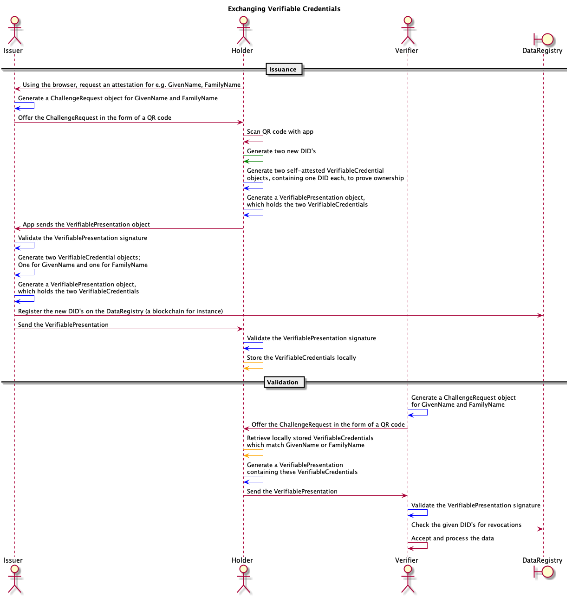

# vp-toolkit

[](https://travis-ci.org/rabobank-blockchain/vp-toolkit)
[](https://codeclimate.com/github/rabobank-blockchain/vp-toolkit/test_coverage)
[](https://codeclimate.com/github/rabobank-blockchain/vp-toolkit/maintainability)
[](https://standardjs.com)

A TypeScript/JavaScript API generating and signing [w3c verifiable credentials](https://www.w3.org/TR/vc-data-model/) and related objects:

- [Verifiable Credential](https://github.com/rabobank-blockchain/vp-toolkit-models/blob/master/src/model/verifiable-credential.ts)
- [Verifiable Presentation](https://github.com/rabobank-blockchain/vp-toolkit-models/blob/master/src/model/verifiable-presentation.ts)
- [Challenge Request](https://github.com/rabobank-blockchain/vp-toolkit-models/blob/master/src/model/challenge-request.ts)
- [Proof](https://github.com/rabobank-blockchain/vp-toolkit-models/blob/master/src/model/proof.ts) _(will be part of the objects above)_

## Installation

In an existing project (with `package.json`), install `vp-toolkit`

```bash
npm install vp-toolkit --save
```

## Flow

The verifiable credentials standard does not mention how the verifiable credentials will be exchanged from one party to another.
The flow will show an example of how you can utilize components of the vp-toolkit to exchange and generate verifiable credentials. Blue lines represent vp-toolkit interactions.
The green line can be a [crypt-util](https://github.com/rabobank-blockchain/crypt-util) interaction, the orange lines are [vc-data-management](https://github.com/rabobank-blockchain/vc-data-management) interactions and the red lines need to be implemented by the developer.
Please note that crypt-util currently can't generate DID's, but it is able to generate public addresses.
Checking the DID's for revocation can be done using the [vc-status-registry](https://github.com/rabobank-blockchain/vc-status-registry) libray if you wish to implement an Ethereum solution.


### Flexible setup

Because the w3c Verifiable Credential standards are still being crafted, we need this flexible setup comprising a generator, signer and crypt-util instance:

- The generator is responsible for the structure, integrity and completeness the final object shown in the list above;
- The signer only decides which fields (in what order) will be signed and validated, not how the fields are signed;
- crypt-util is responsible for signing/validating the payload given by the signer, using the given cryptographic algorithm.

A generator and signer is available for VerifiablePresentation, VerifiableCredential and ChallengeRequest. This setup allows every developer to change the behaviour in every phase of the process.
You can add fields to the ChallengeRequest object by extending it, change the fields included in the signature and even switch to a different cryptographic algorithm.

## Usage

Three examples of creating and validating objects.

### Creating or validating a VerifiableCredential

A VerifiableCredential object can be created using the [VerifiableCredentialGenerator](src/service/generators/verifiable-credential-generator.ts).
This generator needs a signer to sign the VerifiableCredential object.
You can pass a [VerifiableCredentialSigner](src/service/signers/verifiable-credential-signer.ts) instance to the Generator.

```typescript
import { LocalCryptUtils } from 'crypt-util'
import { VerifiableCredentialSigner, VerifiableCredentialGenerator } from 'vp-toolkit'
import { CredentialStatus } from 'vp-toolkit-models'

const yourPrivateKey = 'xprv9s21ZrQH143K4Hahxy3chUqrrHbCynU5CcnRg9xijCvCG4f3AJb1PgiaXpjik6pDnT1qRmf3V3rzn26UNMWDjfEpUKL4ouy6t5ZVa4GAJVG' // Todo: Load your private key here
const cryptAlgorithm = new LocalCryptUtils() // secp256k1 algorithm
const signer = new VerifiableCredentialSigner(cryptAlgorithm)
const generator = new VerifiableCredentialGenerator(signer)

// Creating a VerifiableCredential object:
cryptAlgorithm.importMasterPrivateKey(yourPrivateKey)
const verifiableCredential = generator.generateVerifiableCredential({
  '@context': ['https://www.w3.org/2018/credentials/v1', 'https://schema.org/givenName'],
  id: 'credential-name-or-identifier',
  type: ['VerifiableCredential', 'SomeOtherType'],
  issuer: 'did:protocol:issueraddress',
  issuanceDate: new Date(Date.UTC(2019, 0, 1, 23, 34, 56)),
  credentialSubject: {
    id: 'did:eth:holderaddress',
    givenName: 'John'
  },
  credentialStatus: new CredentialStatus({
    id: '0xE1f6a9A0F05373EC4Ca76FD5F6dd8D0308Ba9de4', // The pointer to the registry. In this case, a smart contract address.
    type: 'vcStatusRegistry2019' // The type so the correct implementation can check for DID revocations
  })
}, 0, 0)

// The generator attaches a proof object to the verifiableCredential so it becomes cryptographically verifiable.

console.log(JSON.stringify(verifiableCredential, null, 2))

// Validating a VerifiableCredential object:
console.log(signer.verifyVerifiableCredential(verifiableCredential)) // true or false
```

### Creating or validating a VerifiablePresentation

Using the same approach as creating a signed VerifiableCredential, you can create a VerifiablePresentation:

```typescript
import { LocalCryptUtils } from 'crypt-util'
import { VerifiablePresentationSigner, VerifiablePresentationGenerator } from 'vp-toolkit'
import { VerifiableCredential } from 'vp-toolkit-models'

const yourPrivateKey = 'xprv9s21ZrQH143K4Hahxy3chUqrrHbCynU5CcnRg9xijCvCG4f3AJb1PgiaXpjik6pDnT1qRmf3V3rzn26UNMWDjfEpUKL4ouy6t5ZVa4GAJVG' // Todo: Load your private key here
const cryptAlgorithm = new LocalCryptUtils() // secp256k1 algorithm
const signer = new VerifiablePresentationSigner(cryptAlgorithm)
const generator = new VerifiablePresentationGenerator(signer)

const existingVerifiableCredentials: VerifiableCredential[] = [] // Todo: Retrieve your VerifiableCredentials from storage!

// Creating a VerifiablePresentation object:
cryptAlgorithm.importMasterPrivateKey(yourPrivateKey)
const verifiablePresentation = generator.generateVerifiablePresentation({
  '@context': ['https://www.w3.org/2018/credentials/v1'],
  id: 'urn:uuid:3978344f-8596-4c3a-a978-8fcaba3903c5',
  type: ['VerifiablePresentation'],
  verifiableCredential: existingVerifiableCredentials
}, 0, 0)

// The generator attaches one proof object for each verifiableCredential, so the credential ownership becomes cryptographically verifiable.

console.log(JSON.stringify(verifiablePresentation, null, 2))

// Validating a VerifiablePresentation object:
console.log(signer.verifyVerifiablePresentation(verifiablePresentation)) // true or false
```

### Creating or validating a ChallengeRequest

```typescript
import { LocalCryptUtils } from 'crypt-util'
import { ChallengeRequestSigner, ChallengeRequestGenerator } from 'vp-toolkit'

const yourPrivateKey = 'xprv9s21ZrQH143K4Hahxy3chUqrrHbCynU5CcnRg9xijCvCG4f3AJb1PgiaXpjik6pDnT1qRmf3V3rzn26UNMWDjfEpUKL4ouy6t5ZVa4GAJVG' // Todo: Load your private key here
const cryptAlgorithm = new LocalCryptUtils() // secp256k1 algorithm
const signer = new ChallengeRequestSigner(cryptAlgorithm)
const generator = new ChallengeRequestGenerator(signer)

// Creating a ChallengeRequest object:
cryptAlgorithm.importMasterPrivateKey(yourPrivateKey)
const challengeRequest = generator.generateChallengeRequest({
  toAttest: ['https://schema.org/familyName'], // These are the subjects you (as an issuer) want to attest to the holder
  toVerify: ['https://schema.org/firstName'], // These are the subjects you (as a verifier) want to receive from the holder
  postEndpoint: 'https://domain.org/ssif/verifiable-presentation-endpoint' // The holder app will post a Verifiable Presentation to this endpoint
}, 0, 0)
// You can use toAttest and toVerify both at the same time, for instance if you require some credentials before issuing.

console.log(JSON.stringify(challengeRequest, null, 2))

// Validating a ChallengeRequest object:
console.log(signer.verifyChallengeRequest(challengeRequest)) // true or false
```

## Running tests

Besides unit testing with Mocha, the effectivity of all tests are also measured with the Stryker mutation testing framework.

```bash
npm run test
npm run stryker
```

We aim to achieve a coverage of 100%. Stryker and/or mocha test scores below 80% will fail the build.

## Contributing

Pull requests are welcome. For major changes, please open an issue first to discuss what you would like to change.

Please make sure to update tests as appropriate.

## License and disclaimer

[apache-2.0](https://choosealicense.com/licenses/apache-2.0/) with a [notice](NOTICE).

We discourage the use of this work in production environments as it is in active development and not mature enough.
